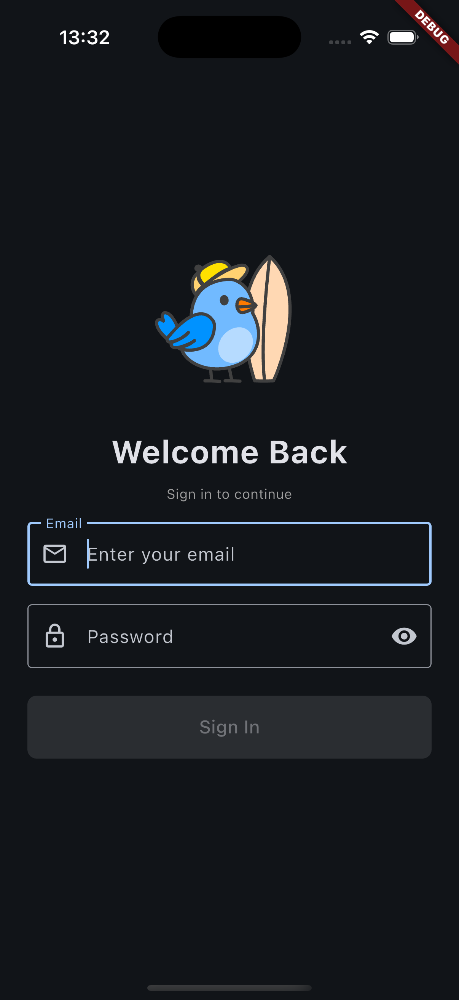

# App Login Demo

A Flutter application implementing a login screen with email and password validation, a mocked backend delay, and navigation to a secondary screen.

## Screenshot

  

## Project Structure

- **/** - Project root
- **/docs** - Documentation files (e.g., TASKS.md)
- **/app** - Flutter application source
- **/app/android** - Native Android module for platform-specific functionality

## Setup and Run
`flutter pub get`
`flutter run`

## 🚀 Features

- Email format validation
- Strong password rules (min. 12 chars, upper/lowercase, digit, special char)
- User-friendly error messages
- 3-second simulated backend delay
- Navigation to an empty second screen
- Flutter ↔ Native Android integration example (not done yet)

## Dependencies
- Riverpod

### Run Code Gen
`dart run build_runner watch -d`